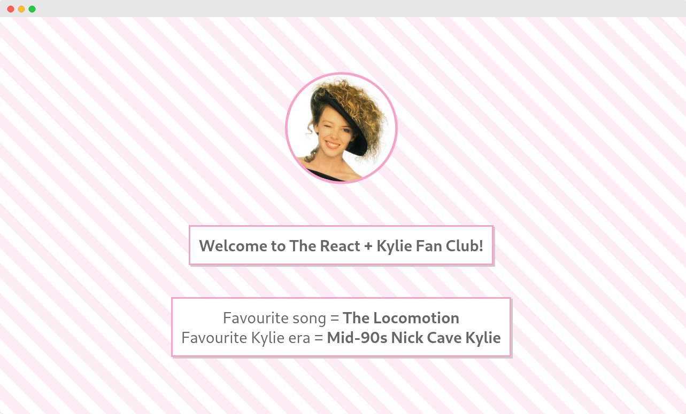

# react-hello-world

**Psst!** There's a blog post to go with this example: <https://www.tutorialworks.com/kubernetes/openshift/deploy-react-app/>

A simple React front-end application, ready to be built in a container.

---

To run tests:

    yarn test

To run:

    yarn start

The app will now start on <http://localhost:3000>

If you hit <http://localhost:3000>, you'll see the homepage.

## Put it in a container

Build a Docker image:

    docker build -t react-hello-world .

This will run a multi-stage Docker build. The first stage builds the production code using `yarn`. This is injected into the second container, which is based on the Bitnami Nginx image.

Now start a container from the image:

    docker run --network=host react-hello-world

You'll be able to access the website at <http://localhost:8080/>.

## Build and deploy in OpenShift

To build and deploy in OpenShift, apply the template which I've provided in this repo:

    oc process -f openshift-template.yml | oc apply -f -

This also shows how you can provide some runtime configuration to the React app. The approach here is to add configuration into a ConfigMap. Then, at runtime, the ConfigMap is mounted into the container. Finally, the HTML page which runs in the user's browser reads this config file. Try changing the values in the ConfigMap and see what happens!

If you don't want to use a template, you can run a Docker build and deploy in OpenShift using `oc new-app`:

    oc new-app https://github.com/monodot/container-up --name=react-hello-world --context-dir=react-hello-world

    oc expose svc/react-hello-world

## Acknowledgements

This project was bootstrapped with [Create React App](https://github.com/facebook/create-react-app).

No Kylie records were harmed in the making of this project.

